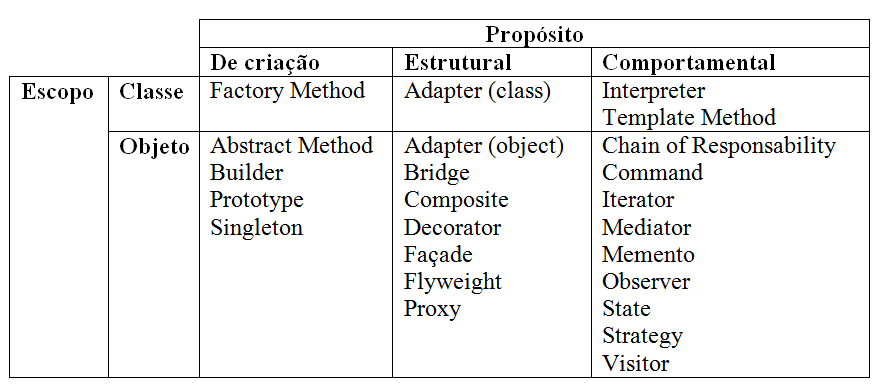

# Design Patterns
Design Patterns são descrições de objetos e classes comunicantes que precisam ser personalizadas para resolver um problema geral de projeto num contexto particular.

## Types of patterns 
Os padrões de projeto são classificados por dois critérios. O primeiro critério, chamado finalidade, reflete o que um padrão faz. Os padrões criacionais se concentram na “criação, composição e representação” de objetos e dispõem de mecanismos que facilitam a instanciação de objetos em um sistema e que impõem “restrições sobre o tipo e numero de objetos que podem ser criados em um sistema”. 
Os padrões estruturais focalizam problemas e soluções associadas a como classes e objetos são organizados e integrados para construir uma estrutura maior. Os padrões comportamentais tratam de problemas associados a atribuição de responsabilidade ente objetos e a maneira como a comunicação é realizada entre objetos. (Pressman, 2016, p. 350) 
O segundo critério, chamado escopo, especifica se o padrão se aplica primariamente a classes ou a objetos. Os padrões para classes lidam com os relacionamentos entre classes e suas subclasses. Esses relacionamentos são estabelecidos através do mecanismo de herança, assim eles são estáticos – fixados em tempo de compilação. 
Os padrões para objetos lidam com relacionamentos entre objetos que podem ser mudados em tempo de execução e são mais dinâmicos. Quase todos utilizam a herança em certa medida. Note que a maioria está no escopo de Objeto. 
Os padrões de criação voltados para classes deixam alguma parte da criação de objetos para subclasses, enquanto que os padrões de criação voltados para objetos postergam esse processo para outro objeto. Os padrões estruturais voltados para classes utilizam a herança para compor classes, enquanto que os padrões estruturais voltados para objetos descrevem maneiras de montar objetos.  
Os padrões comportamentais voltados para classes usam a herança para descrever algoritmos e fluxo de controle, enquanto que os voltados para objetos descrevem como um grupo de objetos coopera para executar uma tarefa que um único objeto não pode executar sozinho. (GAMMA; HELM; JOHNSON; VLISSIDES, 1994, p. 26)
Em geral, um padrão tem quatro elementos essenciais:
1. O nome do padrão é uma referencia que podemos usar para descrever um problema de projeto, suas soluções e consequenciais em uma ou duas palavras. Dar nome a um padrão aumenta imediatamente o nosso vocabulário de projeto. Isso nos permite projetar em um nível mais alto de abstração. Ter um vocabulário para padrões permite-nos conversar sobre eles com nossos colegas, em nossa documentação e até com nós mesmos. O nome torna mais fácil pensar sobre projetos e a comunica-los, bem como os custos e benefícios envolvidos, a outras pessoas. Encontrar bons nomes foi uma das partes mais difíceis do desenvolvimento do catálogo. (GAMMA; HELM; JOHNSON; VLISSIDES, 1994, p. 19)
2. O problema descreve em que situação aplicar o padrão. Ele explica o problema e seu contexto. Pode descrever problemas de projetos específicos, tais como representar algoritmos como objetos. Pode descrever estruturas de classe ou objeto sintomáticas de um projeto inflexível. Algumas vezes, o problema incluirá uma lista de condições que devem ser satisfeitas para que faça sentido aplicar o padrão. (GAMMA; HELM; JOHNSON; VLISSIDES, 1994, p. 19)
3. A solução descreve os elementos que compõem o padrão de projeto, seus relacionamentos, suas responsabilidades e colaborações. A solução não descreve um projeto concreto ou uma implementação em particular porque um padrão é como um gabarito que pode ser aplicado em muitas situações diferentes. Em vez disso, o padrão fornece uma descrição abstrata de um problema de projeto e de como um arranjo geral de elementos – classes e objetos, no nosso caso – o resolve. (GAMMA; HELM; JOHNSON; VLISSIDES, 1994, p. 19)
4. As consequências são os resultados e analises das vantagens e desvantagens – trade-offs – da aplicação do padrão. Embora as consequências sejam raramente mencionadas quando descrevemos decisões de projeto, elas são criticas para a avaliação de alternativas de projetos e para a compreensão dos custos e benefícios da aplicação do padrão. As consequências para o software frequentemente envolvem balanceamento entre espaço e tempo. Elas também podem abordar aspectos sobre linguagens e implementação. Uma vez que a reutilização é frequentemente um fator no projeto orientado a objetos, as consequências de um padrão incluem o seu impacto sobre a flexibilidade, a extensibilidade ou a portabilidade de um sistema. Relacionar essas consequências explicitamente ajuda a compreendê-las e avalia-las. (GAMMA; HELM; JOHNSON; VLISSIDES, 1994, p. 19)

> Design patterns GoF

## Description
- **Abstract Factory:** Fornece uma interface para criação de famílias de objetos relacionados ou dependentes sem especificar suas classes concretas.
- **Adapter:** Converte a interface de uma classe em outra interface esperada pelos clientes. O Adapter permite que certas classes trabalhem em conjunto, pois de outra forma seria impossível por causa de suas interfaces incompatíveis.
- **Bridge:** Separa uma abstração da sua implementação, de modo que as duas possam variar independentemente.
- **Builder:** Separa a construção de um objeto complexo da sua representação, de modo que o mesmo processo de construção possa criar diferentes representações.
-	Chain of Responsability:** Evita o acoplamento do remetente de uma solicitação ao seu destinatário, dando a mais de um objeto a chance de tratar a solicitação. Encadeia os objetos receptores e passa a solicitação ao longo da cadeia até que um objeto a trate.
- **Command:** Encapsula uma solicitação como um objeto, desta forma permitindo que você parametrize clientes com diferentes solicitações, enfileire ou registre – log – solicitações e suporte operações que podem ser desfeitas.
- **Composite:** Compõe objetos em estrutura de árvore para representar hierarquias do tipo partes-todo. O Composite permite que os clientes tratem objetos individuais e composições de objetos de maneira uniforme.
- **Decorator:** Atribui responsabilidades adicionais a um objeto dinamicamente. Os decorators fornecem uma alternativa flexível a subclasses para extensão da funcionalidade.
- **Façade:** Fornece uma interface unificada para um conjunto de interfaces em um subsistema. O Façade define uma interface de nivel mais alto que torna o subsistema mais fácil de usar.
- **Factory Method:** Define uma interface para criar um objeto, mas deixa as subclasses decidirem qual classe a ser instanciada. O Factory Method permite a uma classe postergar – defer – a instanciação as subclasses.
- **Flyweight:** Usa compartilhamento para suportar grandes quantidades de objetos, de granularidade fina, de maneira eficiente.
- **Interpreter:** Dada uma linguagem, define uma representação para sua gramatica juntamente com um interpretador que usa aa representação para interpretar sentenças nessa linguagem.
- **Iterator:** Fornece uma maneira de acessar sequencialmente os elementos de uma agregação de objetos sem expor sua representação subjacente.
- **Mediator:** Define um objeto que encapsula a forma como um conjunto de objetos interage. O Mediator promove o acoplamento fraco ao evitar que os objetos se refiram explicitamente uns aos outros, permitindo que você varie suas interações independentemente.
- **Memento:** Sem violar o encapsulamento, captura e externaliza um estado interno de um objeto, de modo que o mesmo possa posteriormente ser restaurado para este estado.
- **Observer:** Define uma dependência um-para-muitos entre objetos, de modo que, quando um objeto muda de estado, todos os seus dependentes são automaticamente notificados e atualizados.
- **Prototype:** Especifica os tipos de objetos a serem criados usando uma instancia prototípica e criar novos objetos copiando esse protótipo.
- **Proxy:** Fornece um objeto representante – surrogate, ou um marcador de outro objeto, para controlar o acesso ao mesmo.
- **Singleton:** Garante que uma classe tenha somente uma instancia e fornece um ponto global de acesso para ela.
- **State:** Permite que um objeto altere seu comportamento quando seu estado interno muda. O objeto parecerá ter mudado de classe.
- **Strategy:** Define uma família de algoritmos, encapsula cada um deles e os torna intercambiáveis. O Strategy permite que o algoritmo varie independentemente dos clientes que o utilizam.
- **Template Method:** Define o esqueleto de um algoritmo em uma operação, postergando a definição de alguns passos para subclasses. O Template Method permite que as subclasses redefinam certos passos de um algoritmo sem mudar sua estrutura.
- **Visitor:** Representa uma operação a ser executada sobre os elementos da estrutura de um objeto. O Visitor permite que você defina uma nova operação sem mudar as classes dos elementos sobre os quais opera.
