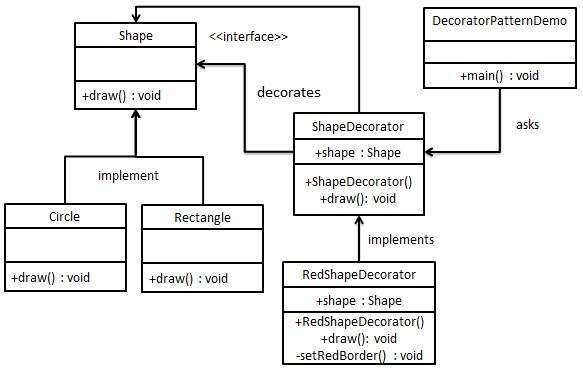

# Decorator Pattern _Estrutural_

> Decorator Pattern _Estrutural_

O padrão Decorator permite que um usuário adicione nova funcionalidade a um objeto existente sem alterar sua estrutura. Esse tipo de padrão de design vem sob o padrão estrutural, pois esse padrão atua como um invólucro para a classe existente. Esse padrão cria uma classe decoradora que envolve a classe original e fornece funcionalidade adicional, mantendo a assinatura dos métodos de classe intacta. - TutorialSpoint 
O padrão Decorator não está fortemente ligado a como os objetos são criados, mas ao invés disso, foca no problema de estender sua funcionalidade. Em vez de depender apenas da herança prototípica, trabalhamos com um único objeto base e adicionamos progressivamente objetos decoradores que fornecem recursos adicionais. A ideia é que, em vez de subclassificar, adicionamos (decoramos) propriedades ou métodos a um objeto base para que seja um pouco mais simplificado. - Osmani 

## Aplicabilidade 
Segundo (GAMMA; HELM; JOHNSON; VLISSIDES), deve-se usar o padrão Decorator quando:
- Para acrescentar responsabilidades a objetos individuais de forma dinâmica e transparente, ou seja, sem afetar outros objetos.
- Para responsabilidades que podem ser removidas.
- Quando a extensão através do uso de subclasses não é prática. Às vezes, um grande número de extensões independentes é possível e isso poderia produzir uma explosão de subclasses para suportar cada combinação. Ou a definição de uma classe pode estar oculta ou não estar disponível para a utilização de subclasses.

