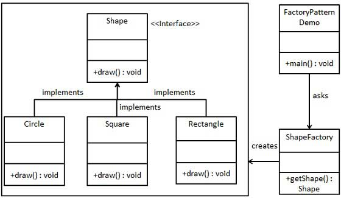

# Factory Method _Criacional_

> Factory Method _Criacional_

No padrão Factory, criamos o objeto sem expor a lógica de criação ao cliente e nos referimos ao objeto recém-criado usando uma interface comum. - Tutotrialspoint
Fornece um método estático encapsulado em uma classe chamada fábrica, a fim de ocultar a lógica de implementação e fazer com que o código do cliente se concentre no uso em vez da inicialização de novos objetos. - Osmani

## When using the factory default
Segundo Osmani (2017), o padrão de fábrica pode ser especialmente útil quando aplicado às seguintes situações:
- Quando nosso objeto ou configuração de componente envolve um alto nível de complexidade
- Quando precisamos gerar facilmente diferentes instâncias de objetos, dependendo do ambiente em que estamos
- Quando estamos trabalhando com muitos pequenos objetos ou componentes que compartilham as mesmas propriedades
- Ao compor objetos com instâncias de outros objetos que precisam apenas satisfazer um contrato de API (também conhecido como, digitação de pato) para funcionar. Isso é útil para desacoplamento.
