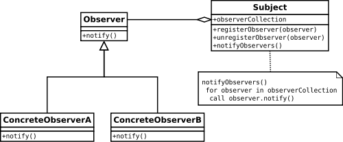

# Observer Pattern _Comportamental_

> Observer Pattern _Comportamental_

Um objeto mantém uma lista de dependentes/observadores e os notifica automaticamente sobre mudanças de estado. Quando não desejamos mais que um determinado observador seja notificado de mudanças pelo sujeito com o qual está registrado, o sujeito pode removê-lo da lista de observadores. 

*“Um ou mais observadores estão interessados no estado de um assunto e registram seu interesse com o assunto anexando-se. Quando algo muda em nosso assunto que o observador possa estar interessado, é enviada uma mensagem de notificação que chama o método de atualização em cada observador. Quando o observador não está mais interessado no estado do sujeito, ele pode simplesmente se destacar. " – GoF* 

Contém os seguintes componentes:
- **Subject:** Mantém uma lista de observadores, facilita a adição ou remoção de observadores.
- **Observer:** Fornece uma interface de atualização para objetos que precisam ser notificados sobre as mudanças de estado de um Assunto.
- **ConcreteSubject:** Transmite notificações para observadores sobre mudanças de estado, armazena o estado de ConcreteObservers.
- **ConcreteObserver:** Armazena uma referência para o ConcreteSubject, implementa uma interface de atualização para o Observer para garantir que o estado seja consistente com o do Subject.

## Aplicabilidade
Segundo (GAMMA; HELM; JOHNSON; VLISSIDES), deve-se usar o padrão Observer em qualquer uma das seguintes situações:
- Quando uma abstração tem dois aspectos, um dependente do outro. Encapsulando esses aspectos em objetos separados, permite-se variá-los e reutilizá-los independentemente;
- Quando uma mudança em um objeto exige mudanças em outros, e você não sabe quantos objetos necessitam ser mudados;
- Quando um objeto deveria ser capaz de notificar outros objetos sem fazer hipóteses, ou usar informações, sobre quem são esses objetos. Em outras palavras, você não quer que esses objetos seja fortemente acoplados.

